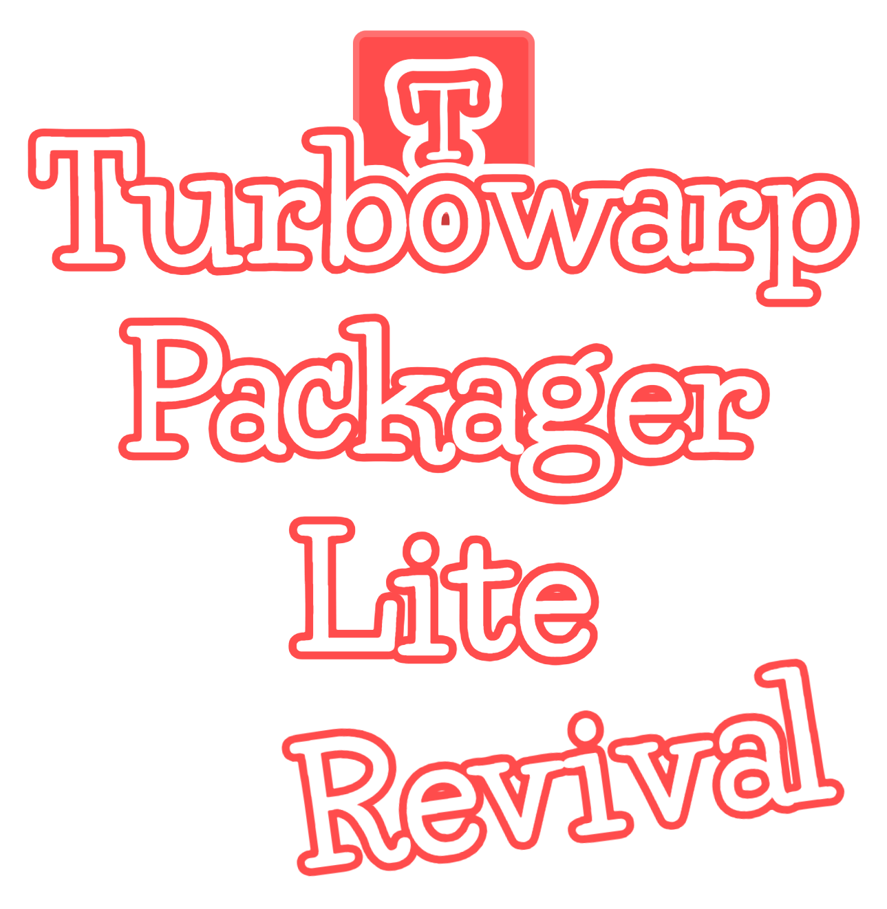

# Turbowarp Packager Lite Revival
A revived version of the original Turbowarp Packager Lite that aims to preserve the features of original version

The features included in revival version are ability to convert Scratch/Turbowarp projects into EXE without using Chromium, but instead using WebView2, just like in original version.

## How to Use
1. Convert your Scratch/Turbowarp project to zip in [Turbowarp Packager](https://packager.turbowarp.org/)
2. Extract files of zip to resources/app folder
3. Click `run.bat` (Windows) or `run.sh` (MacOS/Linux)
4. You can type test, compile or exit to choose whether you want to preview the game, compile to EXE, or close the window

You're done!

> [!WARNING]
> Unfortunately, Turbowarp Packager Lite Revival only support project with stage size of 480x360, so project with custom stage size are not supported, unlike original Turbowarp Packager.

## Credits
- sirthegamercoder, Owner of Turbowarp Packager Lite Revival
- Turbowarp Team, App icon

If you find a bug, please report in Issues section!

